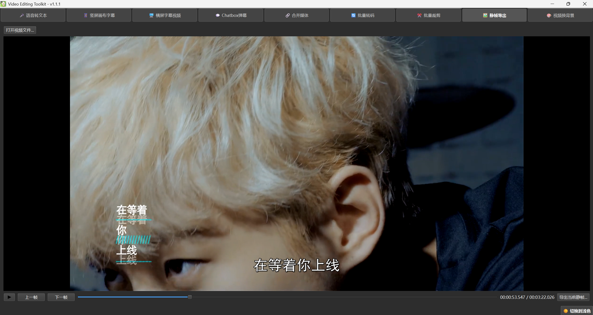
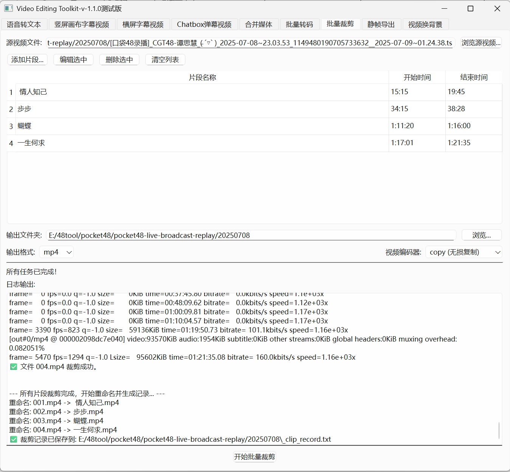
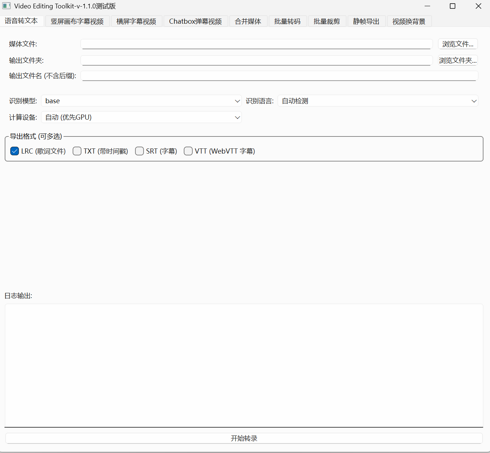

# Video Editing Toolkit v1.1.1

<p align="center">
  
</p>
<h1 align="center">Video Editing Toolkit</h1>
<p align="center">
  一个基于 Python 和 PySide6 构建的桌面视频处理工具箱，集成了 FFmpeg 和 OpenAI-Whisper，旨在为视频创作者提供一系列简单、高效的自动化处理功能。
</p>
<p align="center">
  A desktop video processing toolkit built with Python and PySide6, integrating FFmpeg and OpenAI-Whisper. It aims to provide video creators with a suite of simple and efficient automated processing tools.
</p>

## ✨ 功能展示 (Features Showcase)

| 功能 (Function) | 效果预览 (Preview) |
| :--- | :--- |
| **语音转文本** |  |
| **竖屏画布字幕** |  |
| **横屏字幕 & 静帧导出** |  |
| **Chatbox弹幕效果** |  |
| **批量裁剪** |  |
| **程序主界面** |  |

## 🌟 主要功能详解 (Feature Details)

- **语音转文本 (Speech-to-Text)**
  - 使用 **OpenAI-Whisper** 模型将视频或音频文件高精度地转换为带时间戳的文本。
  - 支持 GPU (CUDA) 加速，大幅提升处理速度。
  - 智能简繁转换，确保输出为统一的简体中文。
  - 支持多格式导出 (`.lrc`, `.srt`, `.vtt`, `.txt`)。
  - 智能字幕切分，确保每行字幕长度和显示时间适中，提升阅读体验。

- **字幕视频合成 (Subtitle Video Synthesis)**
  - **竖屏画布字幕**: 为竖屏视频添加右侧画布，并将字幕精确居中显示。
  - **横屏字幕**: 为传统横屏视频在底部添加居中字幕。
  - **Chatbox弹幕**: 将从48系工具下载的LRC格式弹幕文件，转换为类似直播聊天框的滚动字幕效果。
  - **格式兼容**: 支持导入由“语音转文本”功能生成的四种字幕文件。

- **批量处理工具 (Batch Processing Tools)**
  - **批量裁剪**: 根据时间码列表，从一个源视频中无损或转码裁剪出多个片段。
  - **批量转码**: 批量转换视频格式或从视频中提取音轨。
  - **合并媒体**: 以无损方式快速合并多个视频或音频文件。

- **实用小工具 (Utilities)**
  - **静帧导出**: 内置视频播放器，可逐帧预览并导出任意一帧为高质量图片。对于直播流文件（如.ts, .flv），逐帧功能可能受限于关键帧，建议使用.mp4以获得最佳体验。
  - **视频换背景**: 使用一张静态图片作为背景，与音频文件合成为一个新的视频。

## 🛠️ 技术栈 (Tech Stack)

- **核心框架**: Python 3.12
- **图形界面**: PySide6
- **音视频处理核心**: FFmpeg
- **语音识别**: OpenAI-Whisper
- **简繁转换**: OpenCC
- **打包工具**: PyInstaller

## 🚀 运行与开发 (Usage & Development)

### 1. 使用发行版 (普通用户)

如果您不想进行任何环境配置，可以直接下载我们打包好的版本：


我们为您提供了两个版本，请根据您的电脑配置选择下载：

---

#### 1.1 **【推荐】GPU 加速版 (适用于NVIDIA显卡用户)**

如果您的电脑配备了 **NVIDIA 显卡**，请务必下载此版本以获得极致的“语音转文本”性能。

下载下方压缩包：

1.  下载下方的 `VideoEditingToolkit-v1.1.1-Windows-GPU.7z` 压缩包。
2.  解压到一个您喜欢的位置。
3.  双击运行文件夹内的 `VideoEditingToolkit-v1.1.1-Windows-GPU.exe` 即可。

也支持网盘下载：

-   **文件名**: `VideoEditingToolkit-v1.1.1-Windows-GPU.zip`
-   **体积**: ~2.74 GB
-   **下载链接**:
    -   **夸克云盘**: https://pan.quark.cn/s/ed8700ffe8be
    -   **百度网盘**: https://pan.baidu.com/s/1StyNYv9YXhgFojvOEgVwSQ **提取码**: `8888`

---

#### 1.2 **CPU 精简版 (适用于所有Windows电脑)**

如果您的电脑没有NVIDIA显卡，或者您希望获得一个体积更小的版本（比GPU版少了“语音转文本”加速的功能）请下载此版本。

下载下方压缩包：

1.  下载下方的 `VideoEditingToolkit-v1.1.1-Windows-CPU.zip` 压缩包。
2.  解压到一个您喜欢的位置。
3.  双击运行文件夹内的 `VideoEditingToolkit-v1.1.1-Windows-CPU.exe` 即可。


也支持网盘下载：

-   **文件名**: `VideoEditingToolkit-v1.1.1-Windows-CPU.zip`
-   **体积**: ~349 MB
-   **下载链接**:
    -   **夸克云盘**: https://pan.quark.cn/s/81b449fb0d82
    -   **百度网盘**: https://pan.baidu.com/s/1dOlo8FHLptRK7rRzKACVBw  **提取码**: `8888`

---

#### 1.3 whisper模型下载
语音转文本选择想用的模型，第一次转录就会先开始下载模型，在cmd可以查看模型下载和转录进度。  
如果因为网络下载出现问题，可以通过下面链接下载，然后替换掉models文件夹(包括uij界面的所有模型，按需下载）

-   **文件名**: `models`
-   **体积**: ~10G
-   **下载链接**:
    -   **夸克云盘**: https://pan.quark.cn/s/272f7e8a65bd
    -   **百度网盘**: https://pan.baidu.com/s/18FaHpYwZTk787AgIvyKffw  **提取码**: `8888`

---

### 2. 搭建开发环境 (开发者配置)

如果您熟悉Python虚拟环境，这是参与开发的标准方式。

#### 2.1. 创建虚拟环境

#### a. 创建并激活虚拟环境

```bash
# 使用 Conda (推荐)
conda create -n toolkit-env python=3.12
conda activate toolkit-env

# 或者使用 Python 内置的 venv
python -m venv .venv
# Windows
.\.venv\Scripts\activate
# macOS/Linux
# source .venv/bin/activate
```

#### b. 安装依赖库

在激活的虚拟环境中，执行以下命令：

```bash
# 1. 安装核心依赖 
pip install pyside6 openai-whisper opencc-python-reimplemented 

# 2. (可选, 但强烈推荐) 安装PyTorch以启用GPU加速
# requirements.txt 默认安装的是CPU版本。如果您的电脑配备了NVIDIA显卡，
# 请务必执行以下命令来安装GPU版本，这可以极大地加快“语音转文本”的速度。
#
# 请根据您自己的CUDA版本，访问 https://pytorch.org/get-started/locally/ 
# 获取最适合您环境的安装命令。
#
# 例如 (适用于CUDA 11.8):
pip install torch torchvision torchaudio --index-url https://download.pytorch.org/whl/cu118
```

#### 2.2. 配置 FFmpeg

本项目依赖 `ffmpeg.exe` 和 `ffprobe.exe` 来处理所有音视频任务。请选择以下任一方式进行配置：

#### 方式 A (项目内配置)

1.  **下载**: 前往 [**BtbN/FFmpeg-Builds**](https://github.com/BtbN/FFmpeg-Builds/releases) 下载预编译好的版本。
2.  **选择文件**: 在下载页面，找到最新的 `ffmpeg-master-latest-win64-gpl.zip` 或类似名称的文件并下载。
3.  **解压**: 解压下载的 `zip` 文件后，进入 `bin` 文件夹。
4.  **放置**: 将 `ffmpeg.exe` 和 `ffprobe.exe` 这两个文件复制出来，粘贴到**本项目根目录下**一个**新建**的 `dependencies` 文件夹中。

#### 方式 B (推荐全局配置)

如果您希望在电脑的任何位置都能使用FFmpeg，可以将其添加到系统环境变量中。

1.  **下载并放置**: 按照上述方式下载并解压FFmpeg，但您可以将 `bin` 文件夹放置在电脑的任意位置（例如 `D:\tools\ffmpeg\bin`）。
2.  **编辑环境变量**:
    *   在Windows搜索框中搜索“环境变量”，并选择“编辑系统环境变量”。
    *   在弹出的“系统属性”窗口中，点击“环境变量...”按钮。
    *   在“系统变量”区域，找到名为 `Path` 的变量，双击它。
    *   在“编辑环境变量”窗口中，点击“新建”，然后将您存放 `ffmpeg.exe` 的文件夹路径（例如 `D:\tools\ffmpeg\bin`）粘贴进去。
    *   一路点击“确定”保存所有更改。
3.  **验证**: 重新打开一个新的命令行窗口(CMD)，输入 `ffmpeg -version` 并回车。如果能看到版本信息，说明配置成功。

#### 2.3. 运行程序

-   **对于开发者**: 确保您的虚拟环境已激活，然后在项目根目录的命令行中运行：
    ```bash
    python main.py
    ```
-   **对于普通用户**: 请直接下载我们打包好的发行版。


## 🙏 致谢 (Acknowledgements)

本项目的诞生和完善，离不开许多人的无私帮助和宝贵建议，在此向他们致以最诚挚的谢意。

#### 核心贡献

*   **西塞罗([@Gexi0619](https://github.com/Gexi0619))**
    -   感谢您在项目架构上提供的专业指导。帮我添加统一编码器配置模块，实现统一管理编码器的功能；还提供了优化视频换背景图运行速度的思路，大大提升了运行速度，也大大降低了文件体积。

*   **我的高中同桌([@cheying123](https://github.com/cheying123))**
    -   感谢您对ui界面的修改，让软件ui界面看起来更高级。

#### 测试与支持

*   同时，也要特别感谢所有参与了早期版本测试的朋友们。你们耐心细致地帮我测试打包后的软件是否缺少依赖文件，是这个项目能够不断变得稳定和易用的幕后英雄。

没有你们，就没有 Video Editing Toolkit 的今天。谢谢大家！

## 🤝 贡献 (Contributing)

我们热烈欢迎各种形式的贡献，无论是报告Bug、提出功能建议，还是直接贡献代码！

如果您想为本项目做出贡献，请遵循以下步骤：

1.  **Fork 本仓库**: 首先，请点击页面右上角的 "Fork" 按钮，将本仓库复制到您自己的GitHub账户下。
2.  **创建新分支 (Create a New Branch)**: 在您自己的仓库中，基于 `main` 分支创建一个新的、有意义的分支名称，例如 `feature/add-new-filter` 或 `fix/ui-bug`。
    ```bash
    git checkout -b feature/your-new-feature
    ```
3.  **进行修改 (Make Your Changes)**: 在新的分支上，尽情地施展您的才华吧！
5.  **提交您的修改 (Commit Your Changes)**:
    ```bash
    git commit -m "Feat: 添加了一个新的滤镜功能"
    ```
6.  **推送到您的Fork (Push to Your Fork)**:
    ```bash
    git push origin feature/your-new-feature
    ```
7.  **创建拉取请求 (Open a Pull Request)**: 回到您在GitHub上的Fork仓库页面，点击 "New pull request" 按钮，向本项目的 `main` 分支发起一个拉取请求(PR)。请在PR的描述中，清晰地说明您做了什么以及为什么。

感谢您的使用！如果您遇到任何问题，欢迎随时在 [Issues](https://github.com/Albert-Chen04/Video-Editing-Toolkit/issues) 页面提出。

## 📄 许可证 (License)

本项目采用 [MIT License](LICENSE)。
