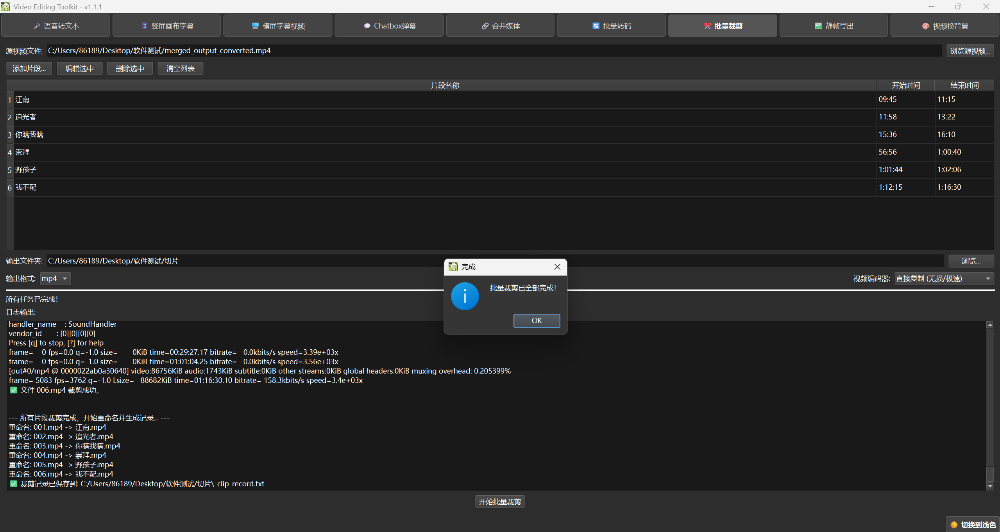

# Video Editing Toolkit v1.1.0

<p align="center">
  
</p>
<h1 align="center">Video Editing Toolkit</h1>
<p align="center">
  一个基于 Python 和 PySide6 构建的桌面视频处理工具箱，集成了 FFmpeg 和 OpenAI-Whisper，旨在为视频创作者提供一系列简单、高效的自动化处理功能。
</p>
<p align="center">
  A desktop video processing toolkit built with Python and PySide6, integrating FFmpeg and OpenAI-Whisper. It aims to provide video creators with a suite of simple and efficient automated processing tools.
</p>

## ✨ 功能展示 (Features Showcase)

| 功能 (Function) | 效果预览 (Preview) |
| :--- | :--- |
| **语音转文本** |  |
| **竖屏画布字幕** |  |
| **横屏字幕 & 静帧导出** |  |
| **Chatbox弹幕效果** |  |
| **批量裁剪** |  |
| **程序主界面** |  |

## 🌟 主要功能详解 (Feature Details)

- **语音转文本 (Speech-to-Text)**
  - 使用 **OpenAI-Whisper** 模型将视频或音频文件高精度地转换为带时间戳的文本。
  - 支持 GPU (CUDA) 加速，大幅提升处理速度。
  - 智能简繁转换，确保输出为统一的简体中文。
  - 支持多格式导出 (`.lrc`, `.srt`, `.vtt`, `.txt`)。
  - 智能字幕切分，确保每行字幕长度和显示时间适中，提升阅读体验。

- **字幕视频合成 (Subtitle Video Synthesis)**
  - **竖屏画布字幕**: 为竖屏视频添加右侧画布，并将字幕精确居中显示。
  - **横屏字幕**: 为传统横屏视频在底部添加居中字幕。
  - **Chatbox弹幕**: 将48tools上下载的录播文件和LRC格式的弹幕文件转换为类似直播聊天框的滚动字幕效果。
  - **格式兼容**: 支持导入由“语音转文本”功能生成的 `.lrc`, `.srt`, `.vtt`, `.txt` 四种字幕文件。
  - **Chatbox弹幕**: 将从48系工具下载的LRC格式弹幕文件，转换为类似直播聊天框的滚动字幕效果。
  - **格式兼容**: 支持导入由“语音转文本”功能生成的四种字幕文件。

- **批量处理工具 (Batch Processing Tools)**
  - **批量裁剪**: 根据时间码列表，从一个源视频中无损或转码裁剪出多个片段。
  - **批量转码**: 批量转换视频格式或从视频中提取音轨。
  - **合并媒体**: 以无损方式快速合并多个视频或音频文件。

- **实用小工具 (Utilities)**
  - **静帧导出**: 内置视频播放器，可逐帧预览并导出任意一帧为高质量图片(最好是.mp4格式的视频文件，因为.ts,.flv是直播流视频文件，下一帧会直到关键帧才会变化)。
  - **静帧导出**: 内置视频播放器，可逐帧预览并导出任意一帧为高质量图片。对于直播流文件（如.ts, .flv），逐帧功能可能受限于关键帧，建议使用.mp4以获得最佳体验。
  - **视频换背景**: 使用一张静态图片作为背景，与音频文件合成为一个新的视频。

## 🛠️ 技术栈 (Tech Stack)

- **核心框架**: Python 3.12
- **图形界面**: PySide6
- **音视频处理核心**: FFmpeg
- **语音识别**: OpenAI-Whisper
- **简繁转换**: OpenCC
- **打包工具**: PyInstaller

## 🚀 运行与开发 (Usage & Development)

我们提供两种环境配置方案，请根据您的喜好选择其一。

### 方案 A：便携式环境 (推荐，开箱即用)

此方案将所有依赖项都放在项目文件夹内，不影响您电脑上的其他Python环境。

#### 1. 搭建便携Python环境

1.  **下载Python**: 前往 [Python官网](https://www.python.org/downloads/windows/)，下载 Python 3.12.x 的 **"Windows embeddable package (64-bit)"** (zip压缩包)。
2.  **解压与放置**: 解压后，将文件夹重命名为 `python_portable`，并移动到本项目根目录下。
3.  **启用第三方库支持**:
    -   进入 `python_portable` 文件夹，找到 `python312._pth` 文件。
    -   用记事本打开它，找到最后一行 `#import site`，将前面的 `#` 号和空格删掉，变成 `import site`，然后保存。
4.  **安装pip**:
    -   用浏览器打开 [https://bootstrap.pypa.io/get-pip.py](https://bootstrap.pypa.io/get-pip.py)，右键另存为，将 `get-pip.py` 文件保存到 `python_portable` 文件夹内。
    -   在项目根目录打开命令行(CMD)，运行：
      ```bash
      .\python_portable\python.exe .\python_portable\get-pip.py
      ```
1.  本项目需要 `ffmpeg.exe` 和 `ffprobe.exe` 两个核心文件。推荐从 [BtbN/FFmpeg-Builds](https://github.com/BtbN/FFmpeg-Builds/releases) 下载预编译好的版本。
2.  在下载页面，找到最新的 `ffmpeg-master-latest-win64-gpl.zip` 或类似名称的文件并下载。
3.  解压后，进入 `bin` 文件夹。
4.  将 `ffmpeg.exe` 和 `ffprobe.exe` 这两个文件复制出来。
5.  在本项目根目录下新建一个 `dependencies` 文件夹，将它们粘贴到文件夹里。
#### 2. 安装依赖库 (便携式)
在项目根目录的命令行中，继续执行：
```bash
# 安装核心依赖
.\python_portable\python.exe -m pip install pyside6 openai-whisper opencc-python-reimplemented pyinstaller

# (可选，推荐) 安装PyTorch以启用GPU加速 (以CUDA 11.8为例)
.\python_portable\python.exe -m pip install torch torchvision torchaudio --index-url https://download.pytorch.org/whl/cu118
```

1.   先在项目根目录下新建一个`python_portable` 文件夹
2.  打开命令行工具 (CMD)。
3.  使用 `cd` 命令进入本项目的根目录。
4.  执行以下命令进入 `python_portable` 目录(先在项目根目录下新建一个`python_portable` 文件夹)：

### 方案 B：使用Conda或venv虚拟环境 (适用于开发者)

如果您熟悉Python虚拟环境，这是一个更灵活的选择。

1.  **创建并激活环境**:
    ```bash
    # 使用 Conda
    conda create -n toolkit-env python=3.12
    conda activate toolkit-env

    # 或者使用 venv
    python -m venv .venv
    .\.venv\Scripts\activate
    ```
5.  **安装核心依赖**:
    ```bash
    # 安装图形库、语音识别、简繁转换和打包工具
    Scripts\pip.exe install pyside6 openai-whisper opencc-python-reimplemented pyinstaller
    ```
6.  **(可选，但强烈推荐) 安装PyTorch以启用GPU加速**:
    如果您的电脑配备了NVIDIA显卡，安装支持CUDA的PyTorch可以极大地加快“语音转文本”的速度。
    ```bash
    # 访问 https://pytorch.org/get-started/locally/ 获取最适合您环境的安装命令
    # 例如 (适用于CUDA 11.8):
    Scripts\pip.exe install torch torchvision toraudio --index-url https://download.pytorch.org/whl/cu118
2.  **安装依赖库**:
    ```bash
    # 安装核心依赖
    pip install pyside6 openai-whisper opencc-python-reimplemented pyinstaller

    # (强烈推荐) 安装PyTorch以启用GPU加速 (以CUDA 12.1为例)
    pip install torch torchvision torchaudio --index-url https://download.pytorch.org/whl/cu121
    ```

### 3. 配置 FFmpeg (任选其一)

- **方法1 (推荐)**: 在项目根目录下新建一个 `dependencies` 文件夹，从 [FFmpeg官网](https://ffmpeg.org/download.html) 或 [BtbN/FFmpeg-Builds](https://github.com/BtbN/FFmpeg-Builds/releases) 下载后，将 `ffmpeg.exe` 和 `ffprobe.exe` 放入此文件夹。
- **方法2 (全局)**: 将 `ffmpeg.exe` 和 `ffprobe.exe` 所在的文件夹路径添加到您电脑的系统环境变量 `PATH` 中。

### 4. 运行程序

- **如果您使用了方案A (便携式)**: 直接双击项目根目录的 `run_app.bat` 文件。
- **如果您使用了方案B (虚拟环境)**: 确保您的虚拟环境已激活，然后在命令行中运行 `python main.py`。

1.  前往本仓库的 [**Releases**](https://github.com/Albert-Chen04/Video-Editing-Toolkit/releases) 页面。
2.  下载最新版本的 `.exe` 程序。
3.  双击运行即可。

### 5. 使用发行版 (For End Users)

如果您不想进行任何环境配置，可以直接下载我们打包好的版本：

1.  前往本仓库的 [**Releases**](https://github.com/Albert-Chen04/Video-Editing-Toolkit/releases) 页面。
2.  下载最新版本的 `.zip` 压缩包。
3.  解压后，双击运行里面的 `.exe` 程序即可。

## 🤝 贡献 (Contributing)

欢迎提交问题 (Issues) 或拉取请求 (Pull Requests)！

## 📄 许可证 (License)

本项目采用 [MIT License](LICENSE)。
